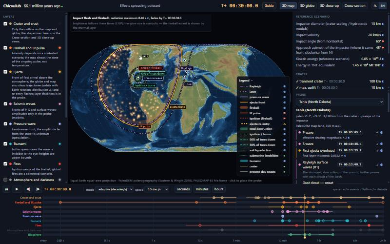
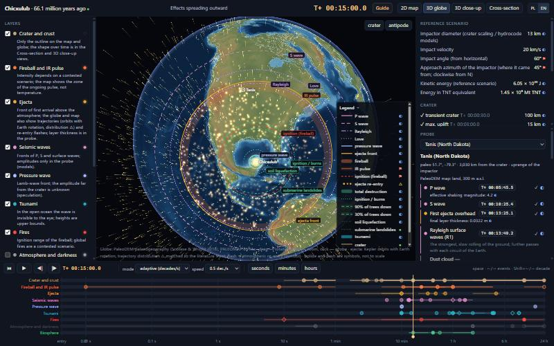
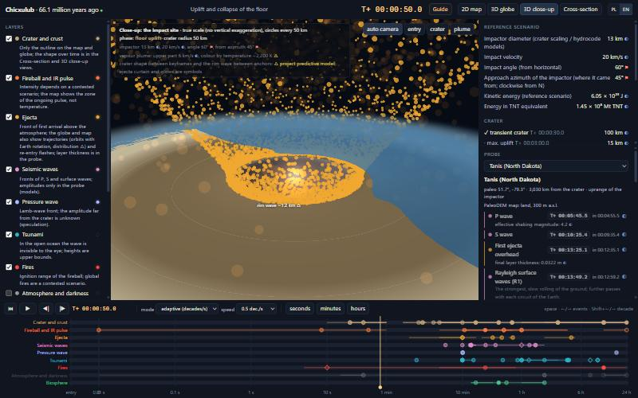
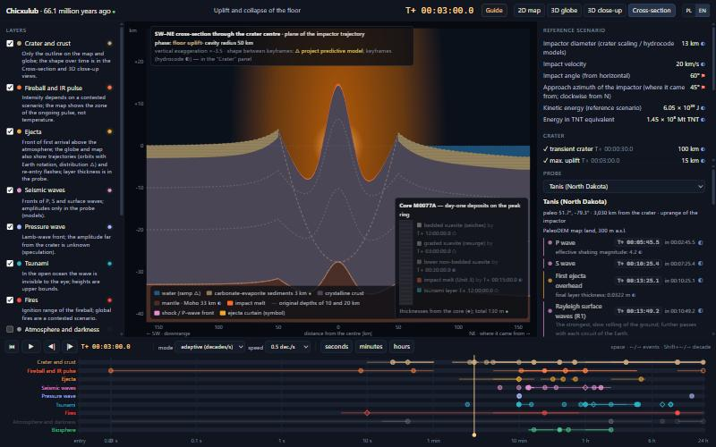

# Chicxulub — pierwsze 24 godziny

[](https://github.com/vus955-gif/chicxulub-impact-simulation/actions/workflows/ci.yml) [](LICENSE)

**[English → README.md](README.md)**

Interaktywna symulacja pierwszej doby po uderzeniu planetoidy Chicxulub sprzed 66 mln lat — od lotu przez atmosferę do T+24 h, na paleogeografii schyłku kredy — w której każda liczba ma źródło.

Ma być narzędziem edukacyjnym, które nie ukrywa niepewności: każda wartość na ekranie pochodzi z rejestru opublikowanych danych albo z modelu na nich policzonego. Po kliknięciu widać metodę, rozrzut w literaturze i źródła (z DOI).

| Paleomapa 2D | Globus 3D |
|---|---|
|  |  |
| **Zbliżenie 3D miejsca uderzenia** | **Przekrój skorupy** |
|  |  |

*Zrzuty ekranu pokazują wersję angielską interfejsu; przełącznik PL/EN jest w prawym górnym rogu.*

## Co widać

- **Cztery widoki na jednym zegarze** — paleomapa 2D (Equal Earth), globus 3D, zbliżenie 3D miejsca uderzenia w prawdziwej skali i animowany przekrój skorupy SW–NE.
- **Fale sejsmiczne, fala ciśnienia w atmosferze (Lamba), front ejekty, impuls podczerwieni, pożary, tsunami, zaciemnienie nieba, strefy skutków dla biosfery** — każda jako opisana warstwa z legendą. Najechanie na linię albo pozycję legendy wyróżnia ją.
- **Ejekta na prawdziwych trajektoriach** — orbity keplerowskie w układzie inercjalnym, pod którymi obraca się Ziemia (długość doby z kredy). W miejscu powrotu materiału do atmosfery pojawia się rozbłysk.
- **Powstawanie krateru** — krater przejściowy, wypiętrzenie centralne, pierścień szczytowy i krater końcowy. Fazy są zakotwiczone w klatkach kluczowych z symulacji hydrokodowych i w rdzeniu wiertniczym IODP-ICDP Expedition 364 (M0077A), którego osady z pierwszej doby narastają w przekroju.
- **Sonda** — kliknij dowolny punkt (albo wybierz jedno z 12 stanowisk granicy K-Pg), aby zobaczyć lokalną chronologię: co i kiedy dociera, z jaką intensywnością i jak działa na biosferę. Dla kluczowych stanowisk sonda pokazuje też porównanie **model kontra literatura** (np. w Tanis fale P, S i Rayleigha docierają w granicach 4–7% od opublikowanych czasów).
- **Przewodnik** — 12 kroków od wejścia w atmosferę do epilogu.
- **Sporne zostaje sporne** — można przełączać scenariusze impulsu cieplnego (Morgan i in. 2013, Goldin i Melosh 2009, Melosh i in. 1990) oraz pożary regionalne i globalne.
- **Interfejs po polsku i po angielsku.**

### Jak pewna jest dana liczba?

| Znak | Znaczenie |
|---|---|
| ● | fakt — pomiar lub obserwacja |
| ◐ | ekstrapolacja — model lub prawo skalowania oparte na znanych mechanizmach |
| ○ | spekulacja — hipoteza bez bezpośredniego potwierdzenia |
| ⚑ | sporne — konkurencyjne interpretacje w literaturze |
| △ | model predykcyjny projektu — wypełnia lukę w literaturze; założenia są wypisane |

Elementy czysto wizualne (wielkość bolidu i błysku, kurtyna ejekty) są oznaczone jako symbole, ale ich chronologia nadal pochodzi z rejestru.

## Szybki start

Wymagania: **Node.js ≥ 20.19** z npm.

```bash
git clone https://github.com/vus955-gif/chicxulub-impact-simulation.git
cd chicxulub-impact-simulation
npm install
npm run dev
```

Otwórz <http://127.0.0.1:5173>. Wszystkie dane potrzebne aplikacji są już w `public/data/`, więc nic nie trzeba pobierać.

| Polecenie | Co robi |
|---|---|
| `npm run dev` | serwer deweloperski z przeładowaniem na żywo |
| `npm run build` / `npm run preview` | build produkcyjny do `dist/` / lokalny podgląd buildu |
| `npm test` | ponad 200 testów: fizyka kontra literatura, spójność rejestru, zachowanie modeli |
| `npm run check`, `npm run typecheck` | kontrola Svelte i TypeScript |
| `npm run registry` | przebudowa rejestru parametrów z `research/` (sprawdza każde źródło i tłumaczenie) |

### Sterowanie

- **Spacja** — start/pauza · **← / →** — poprzednie/następne zdarzenie · **Shift + ← / →** — skok o dekadę czasu.
- Oś czasu można przeciągać. Domyślnie odtwarzanie jest logarytmiczne (każda dekada trwa tyle samo czasu ekranowego); dostępny jest też czas rzeczywisty.
- Kliknięcie mapy lub globusa stawia sondę, a kliknięcie dowolnej wartości otwiera jej źródła.
- Stan (czas, widok, warstwy, sonda, język) jest zapisany w adresie URL, więc można udostępnić link do konkretnej chwili.

## Jak to jest zbudowane

```
research/          rejestr parametrów (JSON), notatki badawcze, raport badawczy (HTML)
  parameters.json  wartości zebrane z literatury, każda z pewnością, metodą, lokalizatorem i źródłami
  sources.json     168 źródeł; DOI sprawdzone w Crossref / DataCite
  synthesis.json   udokumentowane decyzje: co odrzucono, wybrano, poprawiono lub dodano i dlaczego
  i18n-en.json     angielskie teksty rejestru i stanowisk
src/model/         czysta fizyka bez UI, testowana w Node (EIEP, czasy dotarcia, fronty, orbity ejekty,
                   kinematyka krateru, strefy biosfery, modele predykcyjne)
src/app/           interfejs Svelte 5: panele, oś czasu, sonda, legenda, przewodnik, i18n
src/render/        mapa 2D (canvas), globus i zbliżenie 3D (Three.js, własne shadery), przekrój (SVG)
scripts/           potok rejestru (TypeScript) i przetwarzanie danych (Python)
public/data/       dane pochodne używane przez aplikację (rejestr, tekstura paleo-DEM, siatki tsunami, …)
tests/             testy Vitest
```

Najważniejsze metody:

- **Skutki uderzenia** — równania Earth Impact Effects Program (Collins, Melosh i Marcus 2005) zaimplementowane w TypeScript i sprawdzone z oficjalnym kalkulatorem.
- **Czasy dotarcia fal sejsmicznych** — tablice czasów przejścia ak135 (Kennett i in. 1995, policzone w ObsPy TauP). Fronty fal powierzchniowych i fali Lamba wynikają z opublikowanych prędkości grupowych.
- **Tsunami** — czasy dotarcia z rozwiązania eikonalnego √(g·h) na paleobatymetrii PaleoDEM, zwalidowane globalnym modelem Range i in. 2022. Amplitudy pochodzą z wyników tego modelu.
- **Paleogeografia** — PaleoDEM, mapa 16 (Scotese i Wright 2018). Stanowiska, krater i dzisiejsze linie brzegowe zrekonstruowano modelem płyt PALEOMAP w pyGPlates.
- **Ejekta** — orbity keplerowskie z obrotem Ziemi. Rozkład kątów wyrzutu dobrano tak, by najszybsze cząstki odtwarzały opublikowane czasy pierwszego dotarcia.

Raport badawczy `research/raport-chicxulub.html` dokumentuje przegląd literatury stojący za scenariuszem referencyjnym: impaktor 13 km, 20 km/s, kąt 60° od północnego wschodu, ≈ 6 × 10²³ J, krater ~200 km.

## Przebudowa danych (opcjonalnie)

Katalog `public/data/` jest w repozytorium, więc to potrzebne tylko przy zmianie danych wejściowych. Wymagany jest Python 3.11+ z `numpy`, `scipy`, `netCDF4`, `Pillow`, `pygplates` i `obspy` oraz surowe zbiory danych w `data/raw/` (ignorowanym przez git):

| Katalog | Zbiór danych |
|---|---|
| `data/raw/paleodem/` | PaleoDEM, mapa 16, netCDF 6′ (`Map16_PALEOMAP_6min_KT_Boundary_65Ma.nc`) — Scotese i Wright 2018, [doi:10.5281/zenodo.5460860](https://doi.org/10.5281/zenodo.5460860) |
| `data/raw/paleodem/paleomap_plate_model/` | `PALEOMAP_PlateModel.rot`, `PALEOMAP_PlatePolygons.gpml` — [PALEOMAP PaleoAtlas for GPlates](http://www.earthbyte.org/paleomap-paleoatlas-for-gplates/) |
| `data/raw/range2022/` | `MOST_max_output.nc` — dane Range i in. 2022, [doi:10.7910/DVN/GWOFIO](https://doi.org/10.7910/DVN/GWOFIO) |
| `data/raw/naturalearth/ne_50m_coastline/` | linia brzegowa Natural Earth 1:50m — [naturalearthdata.com](https://www.naturalearthdata.com/downloads/50m-physical-vectors/) |

```bash
python scripts/paleodem_assets.py        # tekstura paleo-DEM i siatka wysokości
python scripts/reconstruct_sites_local.py # paleowspółrzędne krateru i stanowisk K-Pg
python scripts/tsunami_grids.py           # czasy dotarcia i amplitudy tsunami, raport walidacji
python scripts/coastlines_paleo.py        # dzisiejsze linie brzegowe obrócone do 65 mln lat
python scripts/ak135_traveltimes.py       # tablice pierwszych wejść ak135 (ObsPy)
npm run registry                          # złożenie, wyprowadzenie, walidacja i eksport rejestru
```

## Ograniczenia

- To nie jest hydrokod. Tam, gdzie istnieją recenzowane wyniki (klatki krateru, tsunami, czasy dotarcia), symulacja je odtwarza; pomiędzy nimi interpoluje, a te fragmenty są oznaczone △.
- Wartości fali uderzeniowej w powietrzu z EIEP w dalekim polu są górnym ograniczeniem (skalowanie zawyża je przy takich energiach), dlatego aplikacja pokazuje pasmo między dolnym a górnym ograniczeniem.
- Kierunek i kąt uderzenia, siła globalnego impulsu cieplnego i zasięg pożarów są w literaturze sporne. Aplikacja pozwala przełączać scenariusze zamiast wybierać zwycięzcę.
- PaleoDEM jest zgrubny w pobliżu szelfu Jukatanu: wokół krateru używana jest predykcyjna rampa głębokości wody, a sonda ostrzega tam, gdzie mapa przeczy morskiemu zapisowi stanowiska.

## Autorzy

- **Pomysł, kierunek naukowy, wymagania i recenzja:** [vus955-gif](https://github.com/vus955-gif)
- **Implementacja:** napisana wspólnie z Claude (Anthropic) jako asystentem programistycznym AI
- **Dane:** zob. [DATA-LICENSES.md](DATA-LICENSES.md); bibliografia jest w aplikacji (kliknij dowolną wartość) i w raporcie badawczym.

Komentarze w kodzie są po polsku; interfejs jest dostępny po polsku i po angielsku.

## Licencja

Kod: [MIT](LICENSE). Dane w `public/data/` zachowują licencje swoich źródeł — zob. [DATA-LICENSES.md](DATA-LICENSES.md).
